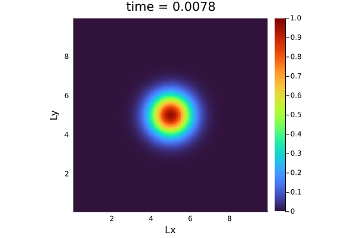
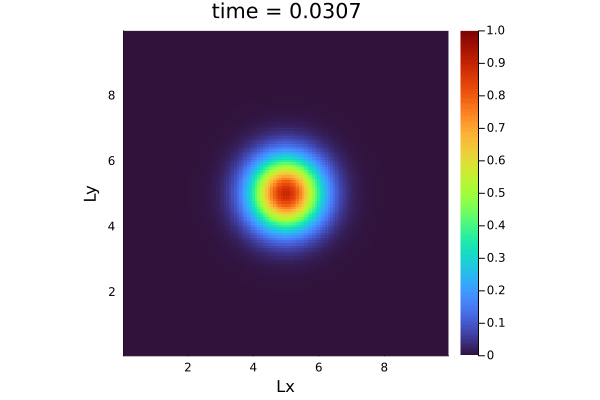
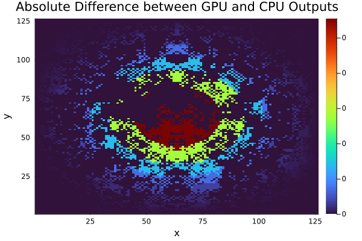
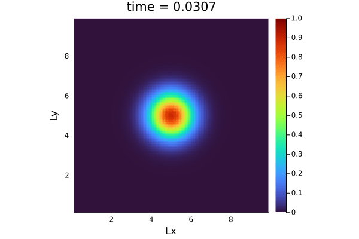
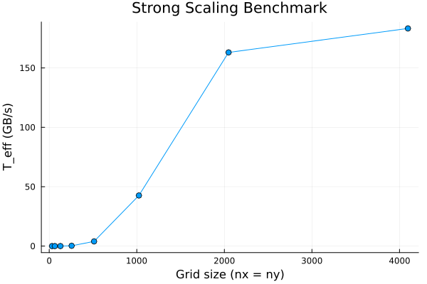
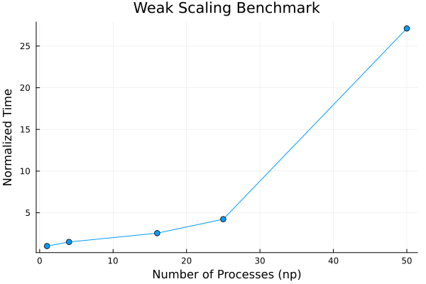
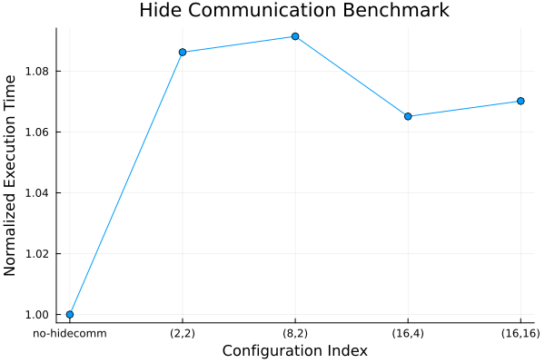

# Multi-xPU 2D Diffusion Solver


The project implements a **2D diffusion equation** solver in **Julia** using **ImplicitGlobalGrid.jl** and **ParallelStencil.jl**. The solver is designed for **multi-xPU parallelized execution** to achieve high-performance, scalable simulation of a pure diffusion process by solving the time evolution of an initial Gaussian concentration distribution. The project was implemented and tested on **Piz Daint** multi-xPU nodes provided by **CSCS**, as part of the course **"Solving Partial Differential Equations in Parallel on Graphic Processing Units"** at **ETH Zürich**.

The governing partial differential equation (PDE) for the simulation is:

$$
\frac{\partial C}{\partial t} = \nabla \cdot (D \nabla C)
$$

where:

- $C(x, y, t)$ is the concentration field.
- $D$ is the diffusion coefficient.
- $\nabla \cdot (D \nabla C)$ represents the Laplacian term governing the diffusive transport.

<div align="center">
  
</div>

## Table of Contents  
1. [Discretization and Numerical Scheme](#discretization-and-numerical-scheme)  
2. [Parallelization and Communication Hiding](#parallelization-and-communication-hiding)  
3. [Reproducing the Diffusion Simulation Using 4 GPU Nodes](#reproducing-the-diffusion-simulation-using-4-gpu-nodes)  
4. [Validation: Comparing Single-xPU Outputs](#validation-comparing-single-xpu-outputs)  
5. [Validation: Comparing Single-GPU and Multi-GPU Outputs](#validation-comparing-single-gpu-and-multi-gpu-outputs)  
6. [Strong Scaling](#strong-scaling)  
7. [Weak Scaling](#weak-scaling)  
8. [Hiding Communications](#hiding-communications)  


## **Discretization and Numerical Scheme**
The implementation employs **finite differences** for spatial discretization:

1. **Flux Calculation:**
   - The fluxes in the $x$- and $y$- directions are discretized as:  

$$
q_x(i, j) = -D \frac{C_{i+1,j} - C_{i,j}}{\Delta x}
$$

$$
q_y(i, j) = -D \frac{C_{i,j+1} - C_{i,j}}{\Delta y}
$$

2. **Divergence of Flux (FVM Approximation):**
   - Using **conservation form**, the update step for $C$ is:

 $$
 C_{i,j}^{n+1} = C_{i,j}^{n} - \Delta t \left[ \frac{q_x(i+1, j) - q_x(i, j)}{\Delta x} + \frac{q_y(i, j+1) - q_y(i, j)}{\Delta y} \right]
 $$
 
&nbsp;&nbsp;&nbsp;&nbsp;&nbsp;&nbsp;&nbsp;&nbsp; 
&nbsp;&nbsp;&nbsp;&nbsp;&nbsp;&nbsp; where $\Delta t$ is determined by the CFL condition.


## **Parallelization and Communication Hiding**

The parallelization design focuses on combining features from `ImplicitGlobalGrid.jl` for domain decomposition and `ParallelStencil.jl` for high-performance kernel execution.  

We initialize the solver dynamically to target **multi-GPU execution** or **multi-threaded CPUs**, depending on the user configuration. For example, GPU execution is set up as follows:  

```julia
@init_parallel_stencil(CUDA, Float64, 2)
```

The 2D computational domain is **globally partitioned** across available processors (xPUs) using `ImplicitGlobalGrid.jl`. This allows each process to work on its local subdomain while synchronizing boundary data through **halo exchanges**. The grid updates rely on **parallel kernel execution** with nested parallelism, enabling simultaneous computation across dimensions. A representative update step is shown here:  

```julia
@parallel_indices (ix, iy) function compute!(C2, C, ...)
    C2[ix+1, iy+1] = C[ix+1, iy+1] - dt * ((@qx(...) - @qx(...)) * _dx + ...)
end
```

To further enhance performance, **halo updates** are overlapped with computation using the **`@hide_communication`** construct, reducing idle times during inter-subdomain data exchanges. Performance metrics such as **effective memory bandwidth (`T_eff`)** are tracked to evaluate efficiency and optimize the implementation as needed.

For a comprehensive discussion of the implementation details and parallelization design, please refer to [Parallelization.md](./docs/Parallelization.md).


## Reproducing the Diffusion Simulation Using 4 GPU Nodes

The animation above shows the diffusion process over a 2D grid using distributed computing across multiple GPUs. To reproduce the animation, we ran the multi-xpu scrint using 4 compute nodes on Piz Daint:

```
srun -n 4 julia --project=. diffusion_2D_perf_multixpu.jl
```

Sample Output:

```
Global grid: 250x250x1 (nprocs: 4, dims: 2x2x1)
Animation directory: ./viz2D_mxpu_out/
Time = 37.974 sec, T_eff = 0.02 GB/s (niter = 2553)
Time = 37.996 sec, T_eff = 0.02 GB/s (niter = 2553)
Time = 38.005 sec, T_eff = 0.02 GB/s (niter = 2553)
Time = 38.028 sec, T_eff = 0.02 GB/s (niter = 2553)
[ Info: Saved animation to /scratch/snx3000/class203/diffusion_2D_mxpu.gif
```

## Validation: Comparing Single-xPU Outputs

We use the script `l8_diffusion_2D_perf_xpu.jl`, which is designed for **single-xPU execution** (no domain decomposition or inter-xPU communication), to validate that CPU and GPU runs with the same parameters produced consistent outputs. We confirmed that the parallel finite difference updates behaved reliably on both multi-threaded CPUs and GPUs before extending the implementation to a multi-xPU setup.

<table style="width: 100%; table-layout: fixed;">
  <tr>
    <td align="center">
      
    </td>
    <td align="center">
      
    </td>
  </tr>
  <tr>
    <td align="center" style="background-color: #333; color: white; padding: 10px; border-radius: 5px;">
      <strong>Fig. 1:</strong> Simulation executed on GPU (<code>USE_GPU = true</code>).
    </td>
    <td align="center" style="background-color: #333; color: white; padding: 10px; border-radius: 5px;">
      <strong>Fig. 2:</strong> Simulation executed on CPU (<code>USE_GPU = false</code>).
    </td>
  </tr>
</table>


We used a script `compare_outputs.jl` to numerically measure and visualize the maximum absolute difference between the outputs. Running the script, we had the following output:

```
Maximum difference between CPU and GPU outputs: 2.7755575615628914e-17
```

The values for each run were saved in the files `C_output_gpu_true.jld2` and `C_output_gpu_false.jld2`, respectively. The absolute difference between the CPU and GPU runs is visualized using the following heatmap (take note of the colorbar values, which shows negligible differences):

<div align="center">
  
</div>


## Validation: Comparing Single-GPU and Multi-GPU Outputs

To demonstrate the performance and scalability differences between **single-GPU** (using `l8_diffusion_2D_perf_xpu.jl`) and **multi-GPU** (using `diffusion_2D_perf_multixpu.jl` on 4 GPU nodes) execution, we compare runs using the same problem size and parameters. The multi-GPU setup partitions the domain across multiple GPUs, enabling parallel computation with inter-xPU communication, while the single-GPU run processes the entire domain locally. 

<table style="width: 80%; table-layout: fixed; border-collapse: collapse;">
  <tr>
    <td align="center">
      
    </td>
    <td align="center">
      
    </td>
  </tr>
  <tr>
    <td align="center" style="background-color: #333; color: white; padding: 10px; border-radius: 5px;">
      <strong>Fig. 3:</strong> Animation generated by the current <code>diffusion_2D_perf_multixpu.jl</code> script.
    </td>
    <td align="center" style="background-color: #333; color: white; padding: 10px; border-radius: 5px;">
      <strong>Fig. 4:</strong> Animation generated by the <code>l8_diffusion_2D_perf_xpu.jl</code> script, executed on GPU (<code>USE_GPU = true</code>).
    </td>
  </tr>
</table>


We used the script `compare_multixpu_output.jl` to numerically compare the differences:

```
Normalized difference between Multi-xPU and Single xPU outputs: 0.009627067026212391
Multi-xPU data range: 9.538779518364063e-7 to 0.20249236031530343
Single xPU data range (inner): 1.048443464878423e-6 to 0.19975776702637837
Sample Multi-xPU: [9.538779518364063e-7 1.9248901673983545e-6 2.930264433408078e-6 3.987413094031169e-6 5.114019114712718e-6; 1.9248901673983545e-6 3.884354834904642e-6 5.913157193460889e-6 8.046432794307663e-6 1.0319863188812344e-5; 2.930264433408078e-6 5.913157193460889e-6 9.001593763648288e-6 1.2249056298186256e-5 1.5709857869935528e-5; 3.987413094031169e-6 8.046432794307663e-6 1.2249056298186256e-5 1.6668051586943227e-5 2.1377316849179705e-5; 5.114019114712719e-6 1.0319863188812344e-5 1.5709857869935528e-5 2.1377316849179705e-5 2.7417002585183226e-5]
Sample Single xPU: [1.0484434648784232e-6 2.1151006657843403e-6 3.2182763586032985e-6 4.376454752446499e-6 5.608382779576605e-6; 2.1151006657843403e-6 4.266943365440956e-6 6.4924537195998065e-6 8.828919304939611e-6 1.1314157607796204e-5; 3.218276358603299e-6 6.492453719599806e-6 9.878712340398283e-6 1.3433783050808211e-5 1.7215202724471308e-5; 4.376454752446498e-6 8.828919304939611e-6 1.3433783050808211e-5 1.826818377783561e-5 2.34103549250958e-5; 5.608382779576605e-6 1.1314157607796204e-5 1.7215202724471308e-5 2.34103549250958e-5 2.9999854323200893e-5]
```

The small variance between the **multi-xPU** and **single-xPU** outputs (normalized difference: 0.0096) can be attributed to differences in **numerical precision** and potential **communication overhead** during inter-xPU data exchanges in the multi-GPU setup.


## Strong Scaling 

We developed a script for benchmarking experiments (`diffusion_2D_perf_multixpu_benchmarking.jl`), along with `run_strong_scaling.jl` to execute the benchmarking process.

The strong scaling scheme measures the **effective memory throughput ($T_{\text{eff}}$)** for grid sizes 

$$nx = ny = 16 \times 2^k, \quad k \in [1, 8]$$ 

as the problem size is fixed and computational resources (xPUs) increase. Ideally, the expected performance is a linear increase in $T_{\text{eff}}$ as more xPUs are added, assuming minimal overhead and perfect load balancing during parallel execution.


We ran the script as follows:
```
srun -n 1 julia --project=. run_strong_scaling.jl
```

Running the script will save the results into a text file and create a corresponding visualization:

<div align="center">

| **Grid Size** ($n_x = n_y$) | **$T_{\text{eff}}$ (GB/s)**         |
|-----------------------------|-------------------------------------|
| $32$                          | $6.63 \times 10^{-5}$              |
| $64$                          | $1.07 \times 10^{-3}$              |
| $128$                         | $1.70 \times 10^{-2}$              |
| $256$                         | $0.26$                             |
| $512$                         | $3.95$                             |
| $1024$                        | $42.62$                            |
| $2048$                        | $163.07$                           |
| $4096$                        | $183.25$                           |

</div>

<div align="center">
  
</div>

 
The effective memory throughput $T_{\text{eff}}$ improves significantly with increasing grid size, demonstrating better GPU utilization for larger problem sizes. However, beyond a grid size of $4096$, $T_{\text{eff}}$ begins to plateau, suggesting diminishing returns due to resource saturation, such as memory bandwidth limits or computational overhead.


## Weak Scaling


We developed the script `diffusion_2D_perf_multixpu_weak_scaling.jl` for benchmarking experiments and created `run_weak_scaling.jl` to perform the benchmarking process.

The weak scaling scheme measures the **normalized execution time** as the problem size per process is held constant while the number of processes ($np$) increases. For each process count, the total grid size is scaled proportionally to maintain a constant workload per xPU, with grid dimensions given by 

$$nx = ny = 64 \times \sqrt{np}, \quad np \in \{1, 4, 16, 25, 50\}.$$

Ideally, the normalized execution time should remain constant as $np$ increases, reflecting perfect scalability with minimal communication overhead and efficient parallel execution.

We ran the script using the following command:
```
srun -n 1 julia --project=. weak_strong_scaling.jl
```

Running the script will save the results into a text file and create a corresponding visualization:

<div align="center">

| **Number of Processes** ($n_p$) | **Normalized Execution Time** ( $\text{Time}$ ) |
|---------------------------------|-----------------------------------------------|
| $1$                             | $1.00$                                        |
| $4$                             | $1.49$                                        |
| $16$                            | $2.55$                                        |
| $25$                            | $4.22$                                        |
| $50$                            | $27.11$                                       |

</div>

<div align="center">
  
</div>

 
The normalized execution time increases with the number of processes ($n_p$), indicating overhead in inter-process communication. The jump from $25$ to $50$ processes shows a significant increase in time, likely due to communication bottlenecks or increased synchronization overhead. This suggests limited scalability, particularly for larger process counts, highlighting the need for optimization in data communication or load balancing.

**Additional Note**:  

For weak scaling, we adjusted $n_p = [ 1, 4, 16, 25, 50 ]$, replacing $64$ with $50$ processes, due to unavailable nodes. 

```
Running for np = 64...
srun: Job 58273220 step creation temporarily disabled, retrying (Requested nodes are busy)
srun: Job 58273220 step creation still disabled, retrying (Requested nodes are busy)
srun: Job 58273220 step creation still disabled, retrying (Requested nodes are busy)
```


## Hiding Communications

Hiding communication overlaps halo updates with computations, aiming to reduce idle time and improve parallel performance by minimizing synchronization overhead. We tested configurations using `@hide_communication` with varying overlap degrees (e.g., `(2,2)`, `(8,2)`) against a baseline without hiding. Ideally, increased overlap should lead to lower normalized execution times, reflecting improved efficiency.

```julia
for it = 1:nt
    @hide_communication (tuple_val[1], tuple_val[2]) begin
        @parallel compute!(C2, C, 1.0 / dx, 1.0 / dy, dt, 1.0 / dx, 1.0 / dy, size(C, 1) - 2, size(C, 2) - 2)
        C, C2 = C2, C
        update_halo!(C)
    end
end
```

We used the scripts `diffusion_2D_perf_multixpu_hide_comm.jl` and `run_hide_comm_benchmarking.jl` for this task. 

<div align="center">

| **Configuration** ($\text{Config}$) | **Normalized Execution Time** ($\text{Time}$) |
|-------------------------------------|-----------------------------------------------|
| $\text{no-hidecomm}$                | $1.00$                                        |
| $(2,2)$                             | $1.09$                                        |
| $(8,2)$                             | $1.09$                                        |
| $(16,4)$                            | $1.07$                                        |
| $(16,16)$                           | $1.07$                                        |

</div>

<div align="center">
  
</div>


The results show minimal improvements, with normalized execution times only slightly reduced to around **$1.07$** for higher overlap configurations. This suggests that while hiding communication generally helps, its impact is limited, likely due to relatively small communication overhead or insufficient overlap in this setup. 

These results were obtained with $n_x$ = $n_y$ = $64$, which is not optimal; higher resolutions could better highlight the advantages of communication hiding.
